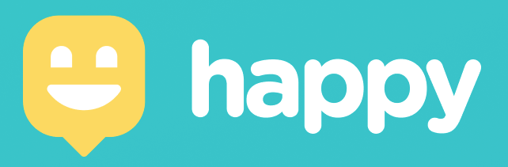

  

<h3 align="center">
  Bring happiness to the world
</h3>

  
  
  
  

<h4 align="center">
  <strong>🚧 &nbsp; Next Level Week #3 &nbsp; 🚀 &nbsp; Under construction... &nbsp; 🚧</strong>  
</h4>

 

## Overview

An app that connects people to nearby orphanages, bringing up happiness to children`s lifes. Application developed at Rocketseat's Next Level Week 2.0.
